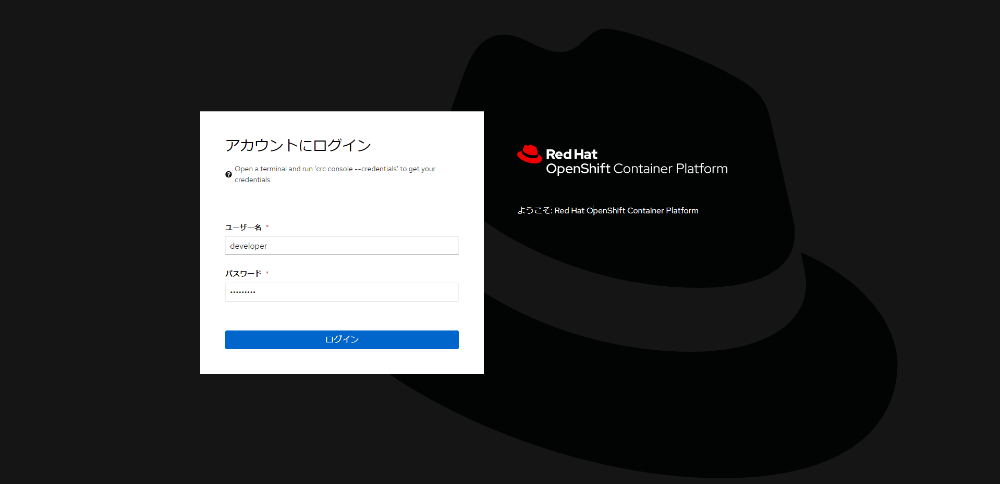
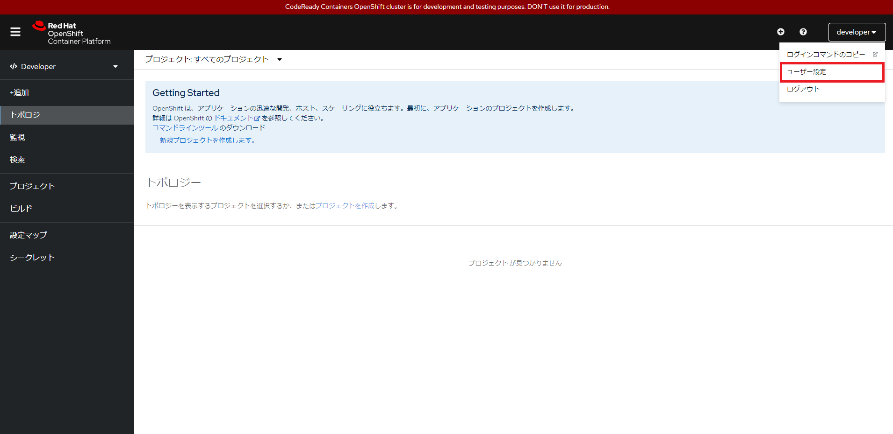
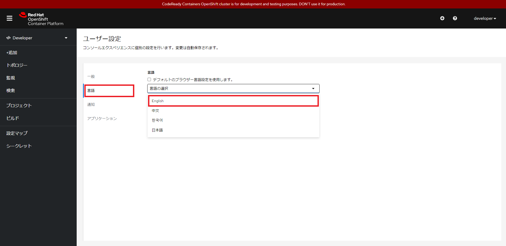
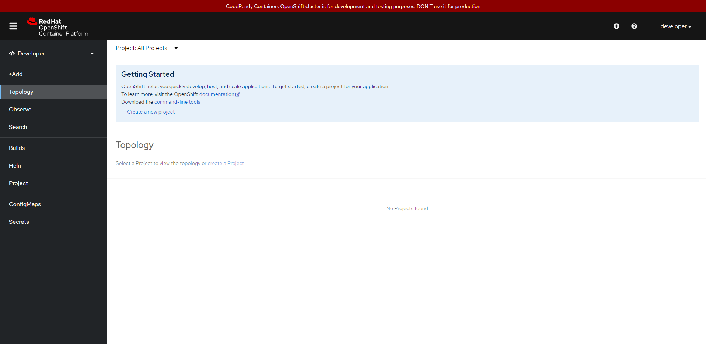
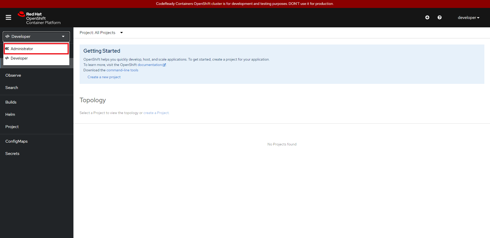

# 1. クライアント操作

ここでは OpenShift の基本操作について学習します。今回のハンズオン環境の説明から、OpenShift へのログイン、CLI/GUI 操作を実施していきます。

**ゴール**

- OpenShift に CLI/GUI でログインできる
- Project が作成できる
- カレントプロジェクトを切替えることができる

**セクション**

- 1.1. Red Hat CodeReady Containers
- 1.2. CLI ログイン
- 1.3. GUI ログイン
- 1.4. Project 作成

<div style="page-break-before:always"></div>

## 1.1. Red Hat CodeReady Containers
今回のハンズオンは Azure VM に用意した CodeReady Containers（以降 CRC） を利用します。まずは CRCが起動している VM にログインしてみましょう。

**Step 1** 手元端末のターミナルソフト等を使ってAzure VMにSSH接続します。

- IPアドレス(Public IP): 当日Slackで共有
- ユーザー名: 「user01」~「user07」のいずれか
- パスワード: APC共通パスワード

**Step 2**  ログインしたユーザーで oc コマンドが実行できることを確認します。

```
$ oc version
Client Version: 4.9.0-202109101042.p0.git.96e95ce.assembly.stream-96e95ce
Server Version: 4.9.0
Kubernetes Version: v1.22.0-rc.0+894a78b
```

<div style="page-break-before:always"></div>

## 1.2. CLI ログイン

Openshift の操作には OpenShift の環境にログインする必要があります。CRC では以下の二つのユーザが用意されているため、用意されているユーザでログインしてみます。

管理者アカウント
- Username：kubeadmin
- Password：WRgq4-DqhiJ-WBSXE-RFsNg

一般ユーザアカウント
- Username：developer
- Password：developer

**Step 1** ```developer``` アカウントでログインします。

```
$ oc login -u developer -p developer
Login successful.

You don't have any projects. You can try to create a new project, by running

    oc new-project <projectname>

$ oc whoami
developer
```

```
Note
oc login：指定した URL、アカウントでログインします
ex) oc login localhost:8443 --username=myuser --password=mypass

オプション
-p：パスワードを指定します
  　指定が無い場合は、パスワードを入力するプロンプトが表示されます
-u：ユーザ名を指定します
```

```
Note
oc whoami：現在のログインアカウントのユーザ名を出力します

オプション
--show-server：接続先環境の URL を出力
-t ：トークンを出力
```

<div style="page-break-before:always"></div>

## 1.3. GUI ログイン
CLI でログインができたので、今度は GUI でログインしてみます。
今回はSSHポートフォワーディングを利用して、Web Consoleに接続します。

**Step 1** ハンズオンに使用している手元端末の hosts ファイルに以下のエントリを追加します。

```
127.0.0.1 api.crc.testing canary-openshift-ingress-canary.apps-crc.testing console-openshift-console.apps-crc.testing default-route-openshift-image-registry.apps-crc.testing downloads-openshift-console.apps-crc.testing oauth-openshift.apps-crc.testing
```
```
Note
OpenShiftではアクセス先URLのホスト名をもとにサービスディスカバリを行っています。
```

```
Important
Windows端末でhostsファイルを編集するには、管理者権限が必要です。
```

**Step 2** コマンドプロンプト or PowerShell 等のコマンドラインから、SSHポートフォワードを行います。
※ユーザー名（user01）の部分は接続確認時のユーザーを指定してください。

```
ssh user01@xxx.xxx.xxx.xxx -N -L 443:192.168.130.11:443 -L 80:192.168.130.11:80
user01@xxx.xxx.xxx.xxx's password:
```

```
Important
SSHポートフォワーディングの際には必ず443から443に、80から80にポートフォワードする必要があります。
```

**Step 3** 手元端末でブラウザを開き、Web ConsoleのURLにアクセスすると、Web ログイン画面が表示されます。

```
URL: https://console-openshift-console.apps-crc.testing
```

**Step 4** ```developer``` アカウントでログインします。



```
Note
「パスワードを変更してください」のダイアログが表示されても「OK」を押してとじてください
```

**Step 5** Web コンソールの言語がデフォルトで日本語になっている場合、英語に変更します。

右上のユーザー名を選択して、「ユーザー設定」を選択します。


デフォルトのブラウザー言語設定を使用します。にチェックが入っている場合はチェックを解除します。

「Language」を選択し、「日本語」から「English」に変更します。


ブラウザを更新すると設定が更新され、英語表記に変わります。


**Step 6** サイドバーのパースペクティブを「Developer」から「Administrator」に変更します。サイドバーの表示項目が変更されることを確認してください。



```
Note
パースペクティブ（perspective）：見方
作業内容に応じた表示項目に変更することができます

参考
https://access.redhat.com/documentation/ja-jp/openshift_container_platform/4.10/html/web_console/odc-about-developer-perspective
```

## 1.4. Project 作成
ログインの確認ができたところで、CLI から Project を作成します。

**Step 1** SSH接続したターミナルを開き、```developer``` アカウントでログインしていることを確認してください。```kubeadmin``` アカウントの場合は ```develoepr``` アカウントでログインしてください。

```
$ oc whoami
developer
```

**Step 2** ```developer``` アカウントで既存の Project を確認します。

```
$ oc projects
You are not a member of any projects. You can request a project to be created with the 'new-project' command.
```

Project が1つも表示されない事を確認してください。

```
Note
oc projects：既存のプロジェクトを出力します
           　また、現在操作中のプロジェクトがマーク（*）されます
```

```
Important
「oc projects」と「oc project」は別のコマンドになります。前者の「projects」はプロジェクトの一覧を出力しますが、「oc project」は現在操作中のプロジェクト名の出力、または操作プロジェクトを変更するコマンドになります。
```

**Step 3**  管理者アカウントである```kubeadmin```アカウントでログインし、プロジェクトの一覧を表示してみます。

```
$ oc login -u kubeadmin

$ oc projects
You have access to the following projects and can switch between them with ' project <projectname>':

  * default
    kube-node-lease
    kube-public
    kube-system
    openshift
・・・
```

**Step 4** ```oc new-project``` コマンドで新しいプロジェクトを作成します。
プロジェクト名は受講者同士で重複しないように、以下の命名規則に沿ってそれぞれ作成してください。
※以降も受講者固有の名前を設定する場合は以下の命名規則に沿って設定を行ってください。

- APCメールアドレスの @ 以前の部分をプロジェクト名とする。
  _（アンダースコア）は -（ハイフン）に置き換える。

例: @の前半部分が n_sakamaki の場合、プロジェクト名は ```n-sakamaki``` となる。
※以降、コマンド実行結果に```n-sakamaki```が含まれることがありますが、その部分にご自身の名前が表示されることを確認してください。

```
$ oc new-project <your_name>

コマンド実行例
$ oc new-project n-sakamaki
Now using project "n-sakamaki" on server "https://api.crc.testing:6443".
・・・
```

新しいプロジェクトが作成され、現在操作中のプロジェクト（以降、カレントプロジェクト）に設定されていることが確認できます。
```
$ oc project
Using project "n-sakamaki" on server "https://api.crc.testing:6443".
```

**Step 5** ```oc new-project``` コマンドでもう１つ新しいプロジェクトを作成します。
先ほど作成したプロジェクト名の後ろに「2」を付けた名前のプロジェクトを作成してください。

```
$ oc new-project <your_name>2
Now using project "n-sakamaki2" on server "https://api.crc.testing:6443".
・・・

$ oc projects
You have access to the following projects and can switch between them with ' project <projectname>':

・・・
    n-sakamaki
  * n-sakamaki2
・・・
Using project "n-sakamaki2" on server "https://api.crc.testing:6443".
```

新しいプロジェクトが作成され、カレントプロジェクトが切替わっていることが確認出来ます。また、 ```oc projects``` コマンドでカレントプロジェクトが、新たに作成したプロジェクトになっていることが確認できます。

**Step 5** 最後にカレントプロジェクトを切替えてみます。

```
$ oc project <your_project>
Now using project "n-sakamaki" on server "https://api.crc.testing:6443".

$ oc projects
You have access to the following projects and can switch between them with ' project <projectname>':

・・・
  * n-sakamaki
    n-sakamaki2
・・・
Using project "n-sakamaki" on server "https://api.crc.testing:6443".
```

```
Note
oc project：カレントプロジェクトを出力します
          　コマンドの末尾にプロジェクト名が指定された場合は、カレントプロジェクトを変更します。
```
