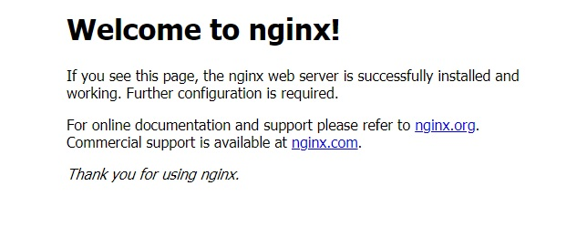

# 2. オブジェクト作成
ここではOpenShiftのオブジェクト作成について学習します。```oc``` コマンドを使ってコンテナ（Pod）や Service、PV などのオブジェクトを実際に作成してみます。

**ゴール**

- Pod/Deployment が作成できること
- yaml からオブジェクトをデプロイできること
- Replication を使って Pod の数を増減できること
- Route / Service を使って Pod にアクセスできること
- PV/PVC を使ってデータの永続化ができること
- get / describe コマンドを使ってオブジェクトの情報が取得できること

**セクション**

- 2.1. Pod 作成
- 2.2. Pod へのアクセス
- 2.3. DeploymentConfig 作成
- 2.4. Pod のレプリカ数増減
- 2.5. Service / Route 作成
- 2.6. PV/PVC 作成
- 2.7. get/describe 色々

このセクションでは```kubeadmin```アカウントでハンズオンを進めるので、```kubeadmin```アカウントでログインしていることを確認します。また、カレントプロジェクトが自身が作成したプロジェクトになっていることを確認します。
```
$ oc login -u kubeadmin

$ oc whoami
kubeadmin

$ oc project
Using project "n-sakamaki" on server "https://api.crc.testing:6443".
```

## 2.1. Pod作成
ここでは Pod を作成し、起動を確認します。<br>

**Step 1** コマンドで Pod を作成します。


```
$ oc run nginx --image=nginx
pod/nginx created
```

```
Note
oc run：クラスターで特定のイメージを実行します。
```

**Step 2** Pod が起動しているか確認します。

```
$ oc get pods
NAME    READY   STATUS              RESTARTS   AGE
nginx   0/1     ContainerCreating   0          3s

$ oc get pods
NAME    READY   STATUS    RESTARTS   AGE
nginx   1/1     Running   0          23s
```

```
Important
起動中の場合は「Running」以外の STATUS となります。
起動が完了すると「Running」となります。
```

**Step 3** 今度は Pod を yaml で作成します。yaml ファイルのテンプレートを作成します。

```
$ mkdir $HOME/nginx

$ cd $HOME/nginx

$ oc run nginx --image=nginx --dry-run=client -o yaml > pod.yaml

$ cat pod.yaml
apiVersion: v1
kind: Pod
metadata:
  creationTimestamp: null
  labels:
    run: nginx
  name: nginx
spec:
  containers:
  - image: nginx
    name: nginx
    resources: {}
  dnsPolicy: ClusterFirst
  restartPolicy: Always
status: {}
```

```
Note
oc run のオプション
--dry-run=client：実際にオブジェクトは作成されず、お試しで実行結果が返ってきます。
-o yaml：-o で出力タイプを指定できます。今回は yaml で指定していますが、他にも json や Go テンプレートなどを指定できます。
```

**Step 4** 作成された yaml ファイルを編集します。

```
vi pod.yaml

※以下に該当する2か所を修正
修正前：name: nginx
修正後：name: nginx2
```

**Step 5** 編集した yaml ファイルを使って、Pod を作成し、動作確認します。

```
$ oc apply -f pod.yaml
pod/nginx2 created

$ oc get pods
NAME     READY   STATUS              RESTARTS   AGE
nginx    1/1     Running             0          2m55s
nginx2   0/1     ContainerCreating   0          4s

$ oc get pods
NAME     READY   STATUS    RESTARTS   AGE
nginx    1/1     Running   0          3m8s
nginx2   1/1     Running   0          17s
```

```
Note
oc apply：指定したファイルに基づいてオブジェクトを管理します。
          オブジェクトの作成や、更新が行われます。
ex) oc apply -f pod.yaml
```

**Step 6** 最後に Pod を削除します。

```
$ oc delete pod nginx
pod "nginx" deleted
```

※nginx2は次の節で利用するため削除しません。

```
Note
oc delete <object type> <object name>：オブジェクトの削除
ex) oc delete pod nginx
オプション
-f <yaml file>：yaml で定義されているオブジェクトを削除する
```

<div style="page-break-before:always"></div>

## 2.2. Pod へのアクセス
起動した Pod にアクセスしてみます。

**Step 1** 対象 Pod でコマンドを実行してみます。

```
$ oc exec nginx2 -- pwd
/

$ oc exec nginx2 -- ls /bin
bash
cat
・・・
```

```
Note
oc exec：対象 Pod またはコンテナでコマンドを実行させます
```

```
Important
「--」は oc コマンドのオプションと、oc exec コマンドで Pod で実行させたいコマンドとの区切り文字として利用します。
「--」が無くても実行できます。
```

**Step3** Pod で bash コマンドを実行させ、コンテナ内にアクセスしてみます。

```
$ oc exec -it nginx2 -- /bin/bash
root@nginx2:/#

root@nginx2:/# ls -l /etc/nginx/
total 24
drwxr-xr-x. 1 root root   26 Mar 20 07:41 conf.d
-rw-r--r--. 1 root root 1007 Jan 25 15:03 fastcgi_params
-rw-r--r--. 1 root root 5349 Jan 25 15:03 mime.types
lrwxrwxrwx. 1 root root   22 Jan 25 15:13 modules -> /usr/lib/nginx/modules
-rw-r--r--. 1 root root  648 Jan 25 15:13 nginx.conf
-rw-r--r--. 1 root root  636 Jan 25 15:03 scgi_params
-rw-r--r--. 1 root root  664 Jan 25 15:03 uwsgi_params

root@nginx2:/# exit
exit
$
```

```
Important
「oc exec」 に -it オプションを付与することで標準入力を受け付けることができます。
```

**Step 4** 作成時に利用した yaml ファイルを利用して削除します。

```
$ oc delete -f pod.yaml
pod "nginx2" deleted

$ oc get po
No resources found in n-sakamaki namespace.
```

```
Note
-f オプションは yaml ファイル内に複数のオブジェクトが定義されている際に、一括で削除することができるため便利です。
```

<div style="page-break-before:always"></div>

## 2.3. DeploymentConfig 作成
Pod 作成が確認できたところで、今度は DeploymentConfig を作成し、起動を確認します。

**Step 1** コマンドで DeploymentConfig を作成します。

```
$ oc adm policy add-scc-to-user anyuid -z default
clusterrole.rbac.authorization.k8s.io/system:openshift:scc:anyuid added: "default"

$ oc create dc nginx --image=nginx --save-config
deploymentconfig.apps.openshift.io/nginx created

$ oc get po
NAME             READY   STATUS      RESTARTS   AGE
nginx-1-deploy   0/1     Completed   0          32s
nginx-1-dvn8d    1/1     Running     0          29s

$ oc get dc,rc,po
NAME                                       REVISION   DESIRED   CURRENT   TRIGGERED BY
deploymentconfig.apps.openshift.io/nginx   1          1         1         config

NAME                            DESIRED   CURRENT   READY   AGE
replicationcontroller/nginx-1   1         1         1       52s

NAME                 READY   STATUS      RESTARTS   AGE
pod/nginx-1-deploy   0/1     Completed   0          52s
pod/nginx-1-dvn8d    1/1     Running     0          49s
```

```
Important
DeploymentConfig は Kubernetes でいう Deployment を拡張したオブジェクトになります。
機能の比較については以下を参照ください。

6.1.4. Deployment および DeploymentConfig オブジェクトの比較
https://access.redhat.com/documentation/ja-jp/openshift_container_platform/4.10/html/building_applications/_deployments#deployments-comparing-deploymentconfigs_what-deployments-are
```

```
Note
オブジェクトタイプは短縮名が定義されています。
po  ⇒ pod
dc  ⇒ deploymentconfig
rc  ⇒ replicationcontroller

「oc api-resources」で各種オブジェクトタイプの詳細が確認できます。
```

**Step 2** 今度は DeploymentConfig を yaml で作成します。yaml ファイルのテンプレートを作成します。

```
$ oc create dc nginx --image=nginx --dry-run=client -o yaml > dc.yaml

$ cat dc.yaml
apiVersion: apps.openshift.io/v1
kind: DeploymentConfig
metadata:
  creationTimestamp: null
  name: nginx
spec:
  replicas: 1
  selector:
    deployment-config.name: nginx
  strategy:
    resources: {}
  template:
    metadata:
      creationTimestamp: null
      labels:
        deployment-config.name: nginx
    spec:
      containers:
      - image: nginx
        name: default-container
        resources: {}
  test: false
  triggers: null
status:
  availableReplicas: 0
  latestVersion: 0
  observedGeneration: 0
  replicas: 0
  unavailableReplicas: 0
  updatedReplicas: 0
```

**Step 3** 作成されたテンプレートを編集します。

```
$ vi dc.yaml

※以下に該当する1か所を修正
修正前：name: nginx
修正後：name: nginx2

※以下に該当する2か所を修正
修正前：deployment-config.name: nginx
修正後：deployment-config.name: nginx2

```

**Step 4** 編集した yaml ファイルを使って、DeploymentConfig を作成し、動作確認します。

```
$ oc apply -f dc.yaml
deploymentconfig.apps.openshift.io/nginx2 created

$ oc get dc,rc,po
NAME                                        REVISION   DESIRED   CURRENT   TRIGGERED BY
deploymentconfig.apps.openshift.io/nginx    1          1         1         config
deploymentconfig.apps.openshift.io/nginx2   1          1         1         config

NAME                             DESIRED   CURRENT   READY   AGE
replicationcontroller/nginx-1    1         1         1       2m21s
replicationcontroller/nginx2-1   1         1         1       22s

NAME                  READY   STATUS      RESTARTS   AGE
pod/nginx-1-deploy    0/1     Completed   0          2m21s
pod/nginx-1-dvn8d     1/1     Running     0          2m18s
pod/nginx2-1-deploy   0/1     Completed   0          22s
pod/nginx2-1-k6rzz    1/1     Running     0          19s
```

**Step 5** nginx2 の DeploymentConfig を削除します。<br>

```
$ oc delete -f dc.yaml
deploymentconfig.apps.openshift.io "nginx2" deleted

$ oc get dc,rc,po
NAME                                       REVISION   DESIRED   CURRENT   TRIGGERED BY
deploymentconfig.apps.openshift.io/nginx   1          1         1         config
NAME                            DESIRED   CURRENT   READY   AGE
replicationcontroller/nginx-1   1         1         1       2m41s

NAME                 READY   STATUS      RESTARTS   AGE
pod/nginx-1-deploy   0/1     Completed   0          2m41s
pod/nginx-1-dvn8d    1/1     Running     0          2m38s
```

※nginx の DeploymentConfig は次の節でも使うので残しておきます。

<div style="page-break-before:always"></div>

## 2.4. Pod のレプリカ数増減
作成した DeploymentConfig の Pod 数を増やしてスケールアウトしてみます。

**Step 1** 現在のレプリカ数を確認します。

```
$ oc get dc
NAME    REVISION   DESIRED   CURRENT   TRIGGERED BY
nginx   1          1         1         config
```

```
Note
oc get dc の出力結果
REVISION：リビジョン番号（後の章で説明します）
DESIRED：期待されている Pod 数
CURRENT：現在の Pod 数
```

**Step 2** レプリカ数を 2 に増やします。

```
$ oc scale dc nginx --replicas=2
deploymentconfig.apps.openshift.io/nginx scaled

$ oc get dc
NAME    REVISION   DESIRED   CURRENT   TRIGGERED BY
nginx   1          2         2         config

$ oc get po
NAME             READY   STATUS      RESTARTS   AGE
nginx-1-8hp5x    1/1     Running     0          22s
nginx-1-deploy   0/1     Completed   0          3m27s
nginx-1-dvn8d    1/1     Running     0          3m24s
```

```
Note
oc scale：指定した DeploymentConfig や ReplicationController などの Pod 数を増減させます
ex) oc scale dc nginx --replicas=2
オプション
--replicas：Pod 数

```

**Step 3** レプリカ数を 0 にして Pod を削除します。

```
$ oc scale dc nginx --replicas=0
deploymentconfig.apps.openshift.io/nginx scaled

$ oc get dc
NAME    REVISION   DESIRED   CURRENT   TRIGGERED BY
nginx   1          0         0         config       0         0         config

$ oc get po
NAME             READY   STATUS      RESTARTS   AGE
nginx-1-deploy   0/1     Completed   0          3m57s
```

Pod は削除されましたが、DeploymentConfig は残っています。このため、レプリカ数を増やすことで Pod が再作成されます。

```
Note
Pod が停止する = アプリケーションが停止すると表現されます。
```

**Step 4** レプリカ数を 1 に戻し、起動します。

```
$ oc scale dc nginx --replicas=1
deploymentconfig.apps.openshift.io/nginx scaled

$ oc get dc
NAME    REVISION   DESIRED   CURRENT   TRIGGERED BY
nginx   1          1         1         config

$ oc get po
NAME             READY   STATUS      RESTARTS   AGE
nginx-1-deploy   0/1     Completed   0          4m33s
nginx-1-qg79s    1/1     Running     0          24s
```


## 2.5. Service / Route の作成
nginx の DeploymentConfig に対して Web アクセスできるようにします。<br>

**Step 1** DeploymentConfig に Port 設定を追加します。

```
$ oc edit dc nginx

※vi が起動するので以下を追加します。
※インデントも下記の通り合わせてください
※「:wq」でプロンプトに戻ります

---------------------------------------------
・・・
    spec:
      containers:
      - image: nginx
        imagePullPolicy: Always
        name: default-container
        resources: {}
        terminationMessagePath: /dev/termination-log
        terminationMessagePolicy: File
        ports:                        # 追加
        - containerPort: 80           # 追加
・・・
---------------------------------------------

※プロンプトから戻ると以下が出力されます
deploymentconfig.apps.openshift.io/nginx edited

$ oc describe dc nginx
・・・
Pod Template:
  Labels:       deployment-config.name=nginx
  Containers:
   default-container:
    Image:              nginx
    Port:               80/TCP
・・・

$ oc get po
NAME             READY   STATUS      RESTARTS   AGE
nginx-1-deploy   0/1     Completed   0          53s
nginx-2-7ldl5    1/1     Running     0          15s
nginx-2-deploy   0/1     Completed   0          19s
```

DeploymentConfig の設定が変更されたことで、Pod にも変更が入り再デプロイされていることが確認できます。

```
Note
oc edit：オブジェクトのマニフェストファイル(yaml)を編集します
         コマンドを実行すると vi が起動し編集できるようになり、
         更新した状態で vi を終了するとデプロイ方式によって、
         更新したファイルで再デプロイされます
ex) oc edit dc nginx
```

```
Note
yaml ファイルに追記した以下2行ですが、Pod 内のコンテナポートを公開する定義となります。

ports:
- containerPort: 80
```

**Step 2** DeploymentConfig アクセス用に Service を作成します。

```
$ oc expose dc nginx
service/nginx exposed

$ oc get svc
NAME    TYPE        CLUSTER-IP     EXTERNAL-IP   PORT(S)   AGE
nginx   ClusterIP   10.217.5.116   <none>        80/TCP    6s

$ oc describe svc nginx
Name:              nginx
Namespace:         n-sakamaki
Labels:            <none>
Annotations:       <none>
Selector:          deployment-config.name=nginx
Type:              ClusterIP
IP Family Policy:  SingleStack
IP Families:       IPv4
IP:                10.217.5.116
IPs:               10.217.5.116
Port:              <unset>  80/TCP
TargetPort:        80/TCP
Endpoints:         10.217.0.87:80
Session Affinity:  None
Events:            <none>
```

```
Note
oc expose：コンテナを内部として Service、外部として Route として公開します。
※Service 以外のオブジェクト(DeploymentConfig や Pod など)を指定すると Service が作成されます
※Service を指定すると Route が作成されます
```

**Step 3** Service は内部用のエンドポイントのため、外部アクセス用に Route を作成します。

```
$ oc expose svc nginx
route.route.openshift.io/nginx exposed

$ oc get route
NAME    HOST/PORT                           PATH   SERVICES   PORT   TERMINATION   WILDCARD
nginx   nginx-n-sakamaki.apps-crc.testing          nginx      80                   None

$ oc describe route nginx
Name:                   nginx
Namespace:              n-sakamaki
Created:                28 seconds ago
Labels:                 <none>
Annotations:            openshift.io/host.generated=true
Requested Host:         nginx-n-sakamaki.apps-crc.testing
                           exposed on router default (host router-default.apps-crc.testing) 28 seconds ago
Path:                   <none>
TLS Termination:        <none>
Insecure Policy:        <none>
Endpoint Port:          80

Service:        nginx
Weight:         100 (100%)
Endpoints:      10.217.0.83:80
```

**Step 4** 前 Step の「oc get route」で出力されている「HOST/PORT」のURLにブラウザからアクセスしてみます。

手元端末のhostsファイルにnginxアクセス用のホスト名を追加します。

```
127.0.0.1 nginx-n-sakamaki.apps-crc.testing
```

**Step 5**
手元端末でブラウザを起動し、nginxアクセス用のURLにアクセスすると、以下のキャプチャのように表示されます。
以下はアクセスするURLの例ですが、プロジェクト名によってURLは異なるので、```oc get route```で確認したものに置き換えてください。
```
URL例: http://nginx-n-sakamaki.apps-crc.testing
```



アクセスできない場合は、再度SSHポートフォワーディングを実行してみてください。\
※xxx.xxx.xxx.xxx はAzure VMのパブリックIPを指定する。
```
ssh user01@xxx.xxx.xxx.xxx -N -L 443:192.168.130.11:443 -L 80:192.168.130.11:80
user01@xxx.xxx.xxx.xxx's password:
```

<div style="page-break-before:always"></div>

## 2.5. PV/PVC 作成
Pod 内で変更・追加したデータは、再起動後には初期イメージの状態に戻ってしまいます。永続化領域を使って、Pod が再起動した際にもデータが永続化されることを試してみます。

**Step 1** 用意されている PV（PersistentVolume）を確認します。

```
$ oc get pv
NAME     CAPACITY   ACCESS MODES   RECLAIM POLICY   STATUS      CLAIM                                                 STORAGECLASS   REASON   AGE
pv0001   100Gi      RWO,ROX,RWX    Recycle          Bound       openshift-image-registry/crc-image-registry-storage                           156d
pv0002   100Gi      RWO,ROX,RWX    Recycle          Available                                                                                 156d
pv0003   100Gi      RWO,ROX,RWX    Recycle          Available                                                                                 156d                                       122d
・・・

$ oc describe pv pv0002
Name:            pv0002
Labels:          volume=pv0002
Annotations:     <none>
Finalizers:      [kubernetes.io/pv-protection]
StorageClass:
Status:          Available
Claim:
Reclaim Policy:  Recycle
Access Modes:    RWO,ROX,RWX
VolumeMode:      Filesystem
Capacity:        100Gi
Node Affinity:   <none>
Message:
Source:
    Type:          HostPath (bare host directory volume)
    Path:          /mnt/pv-data/pv0002
    HostPathType:
Events:            <none>
```

**Step 2** 永続化確認用にコンテナ内のファイルを一つコピーします。

```
$ POD_NAME=$(oc get po -l deploymentconfig=nginx -o=jsonpath={.items[*].metadata.name})

$ oc exec $POD_NAME -- ls -l /usr/share/nginx/html
total 8
-rw-r--r--. 1 root root 497 Jan 25 15:03 50x.html
-rw-r--r--. 1 root root 615 Jan 25 15:03 index.html

$ oc exec $POD_NAME -- cp -p /usr/share/nginx/html/index{,2}.html

$ oc exec $POD_NAME -- ls -l /usr/share/nginx/html
total 12
-rw-r--r--. 1 root root 497 Jan 25 15:03 50x.html
-rw-r--r--. 1 root root 615 Jan 25 15:03 index.html
-rw-r--r--. 1 root root 615 Jan 25 15:03 index2.html
```

```
Note
$(oc get po -l deploymentconfig=nginx -o=jsonpath={.items[*].metadata.name})
↑ は Pod の名前を取るだけのコマンドです
```

**Step 3** index2 にアクセスできることを確認します。

```
$ oc get route
NAME    HOST/PORT                           PATH   SERVICES   PORT   TERMINATION   WILDCARD
nginx   nginx-n-sakamaki.apps-crc.testing          nginx      80                   None
```

「HOST/PORT」 を確認し、「HOST/PORT」の後に「/index2.html」を付けた URL でブラウザにアクセスします。
2.5 で確認した nginx のページが確認できます。

**Step 4** DeploymentConfig のレプリカ数を 1 ⇒ 0 ⇒ 1 の順に変更し、Pod を再起動します。

```
$ oc get dc
NAME    REVISION   DESIRED   CURRENT   TRIGGERED BY
nginx   2          1         1         config

$ oc scale dc nginx --replicas=0
deploymentconfig.apps.openshift.io/nginx scaled

$ oc get dc
NAME    REVISION   DESIRED   CURRENT   TRIGGERED BY
nginx   2          0         0         config

$ oc get po
NAME             READY   STATUS      RESTARTS   AGE
nginx-1-deploy   0/1     Completed   0          7m59s
nginx-2-deploy   0/1     Completed   0          7m25s

$ oc scale dc nginx --replicas=1
deploymentconfig.apps.openshift.io/nginx scaled

$ oc get dc
NAME    REVISION   DESIRED   CURRENT   TRIGGERED BY
nginx   2          1         1         config

$ oc get po
NAME             READY   STATUS      RESTARTS   AGE
nginx-1-deploy   0/1     Completed   0          8m35s
nginx-2-92tpx    1/1     Running     0          26s
nginx-2-deploy   0/1     Completed   0          8m1s
```

**Step 5** 先ほどコピーしたファイルが削除されてしまったことを確認します。

```
$ POD_NAME=$(oc get po -l deploymentconfig=nginx -o=jsonpath={.items[*].metadata.name})

$ oc exec $POD_NAME -- ls -l /usr/share/nginx/html
total 8
-rw-r--r--. 1 root root 497 Jan 25 15:03 50x.html
-rw-r--r--. 1 root root 615 Jan 25 15:03 index.html
```

**Step 6** nginx Pod の index.html ファイルをコピーしてPVに格納します。まずは、Pod 内のファイルをローカルにコピーします。

```
$ POD_NAME=$(oc get po -l deploymentconfig=nginx -o=jsonpath={.items[*].metadata.name})

$ oc cp $POD_NAME:/usr/share/nginx/html/index.html index.html
tar: Removing leading `/' from member names

$ ls
dc.yaml  index.html  pod.yaml
```

```POD_NAME``` は先程再起動をかけた際に、Pod が再作成されているため、取り直しています。

```
Note
oc cp：Pod 内とローカルでファイルコピーを行います。
※Pod 内を指定する場合は <pod name>:<path> で指定します。path は絶対パスです
※コピー元と先の指定は cp コマンドと同様に <コピー元> <コピー先> の順で指定します
ex) oc cp nginx:/tmp/xxx.txt ~/test.txt
```

**Step 7** 次に PVC の yaml ファイルを作成します。

```
vi pvc.yaml
```
以下を入力します。

```
---
apiVersion: v1
kind: PersistentVolumeClaim
metadata:
  name: pvc-nginx
spec:
  accessModes:
    - ReadWriteMany
  resources:
    requests:
      storage: 100Gi
```

**Step 8** 作成した yaml から PVC を作成します。
作成した PVC が いずれかの PV とバインディングしていることを確認します。

```
$ oc apply -f pvc.yaml
persistentvolumeclaim/pvc-nginx created

$ oc get pvc
NAME        STATUS   VOLUME   CAPACITY   ACCESS MODES   STORAGECLASS   AGE
pvc-nginx   Bound    pv0028   100Gi      RWO,ROX,RWX                   2m19s

$ oc get pv
NAME     CAPACITY   ACCESS MODES   RECLAIM POLICY   STATUS      CLAIM                                                 STORAGECLASS   REASON   AGE
・・・
pv0028   100Gi      RWO,ROX,RWX    Recycle          Bound       n-sakamaki/pvc-nginx                                                          23d
・・・
```

**Step 9** 作成した PVC を紐付けるように、DeploymentConfig を修正します。今回は yaml のテンプレートファイルを作成してから修正して、デプロイします。

```
$ oc create dc nginx --image=nginx --dry-run=client -o yaml > nginx.yaml

vi nginx.yaml
```

以下を追記します。

```
・・・
    spec:
      containers:
      - image: nginx
        name: nginx
        resources: {}
        ports:                                     # ここから追加
        - containerPort: 80
        volumeMounts:
        - name: claim-volume
          mountPath: /usr/share/nginx/html
      initContainers:
      - name: volume-mount-hack
        image: busybox
        command: ["sh", "-c", "chmod 755 /mnt"]
        volumeMounts:
        - name: claim-volume
          mountPath: /mnt
      volumes:
      - name: claim-volume
        persistentVolumeClaim:
          claimName: pvc-nginx                    # ここまで追加
  test:
・・・
```

```
Note
「ports」は前述した通り、ポートを公開する定義となります。

「volumes」はマニフェストファイル内で利用する PV を定義しています。今回は紐付け先の PVC を指定しています。

「volumeMounts」は「volumes」で定義した PV を どのパスにマウントするかを定義します。

「initContainers」は初期化用コンテナ定義となります。今回の作業を実施するに当たり、PV のディレクトリの権限を変更する必要があったため、別のコンテナを起動し権限の変更を行っています。
```

**Step 10** 作成した yaml ファイルで、nginx の DeploymentConfig を更新します。

```
$ oc apply -f nginx.yaml
deploymentconfig.apps.openshift.io/nginx configured

$ oc get po
NAME             READY   STATUS      RESTARTS   AGE
nginx-1-deploy   0/1     Completed   0          13m
nginx-2-deploy   0/1     Completed   0          12m
nginx-3-deploy   0/1     Completed   0          20s
nginx-3-ktkj8    1/1     Running     0          17s

$ POD_NAME=$(oc get po -l deploymentconfig=nginx -o=jsonpath={.items[*].metadata.name})

$ oc describe po $POD_NAME
Name:         nginx-3-ktkj8
Namespace:    n-sakamaki
・・・
Containers:
  default-container:
・・・
    Mounts:
      /usr/share/nginx/html from claim-volume (rw)
      /var/run/secrets/kubernetes.io/serviceaccount from kube-api-access-xfkp7 (ro)
・・・
Volumes:
  claim-volume:
    Type:       PersistentVolumeClaim (a reference to a PersistentVolumeClaim in the same namespace)
    ClaimName:  pvc-nginx
    ReadOnly:   false
```

**Step 11** PV がマウントされていることを確認し、ローカルにコピーした index.html ファイルを配置します。

```
$ CONTAINER_NAME=$(oc get po -l deploymentconfig=nginx -o=jsonpath={.items[*].spec.containers[0].name})

$ oc exec $POD_NAME -c $CONTAINER_NAME -- df -hT /usr/share/nginx/html/
Filesystem     Type  Size  Used Avail Use% Mounted on
/dev/vda4      xfs    31G   16G   15G  51% /usr/share/nginx/html

$ oc exec $POD_NAME -c $CONTAINER_NAME -- ls -l /usr/share/nginx/html/
total 0

$ oc cp index.html $POD_NAME:/usr/share/nginx/html/ -c $CONTAINER_NAME

$ oc exec $POD_NAME -c $CONTAINER_NAME -- ls -l /usr/share/nginx/html/
total 4
-rw-rw-r--. 1 1000 1000 615 Apr  1 09:12 index.html
```

合わせて、index.html をコピーして index2.html ファイルも作成します。

```
$ oc exec $POD_NAME -c $CONTAINER_NAME -- cp -p /usr/share/nginx/html/index{,2}.html

$ oc exec $POD_NAME -c $CONTAINER_NAME -- ls -l /usr/share/nginx/html/
total 8
-rw-rw-r--. 1 1000 1000 615 Apr  1 09:12 index.html
-rw-rw-r--. 1 1000 1000 615 Apr  1 09:12 index2.html
```

```
Note
cp -p /usr/share/nginx/html/index{,2}.html
↓
cp -p /usr/share/nginx/html/index.html /usr/share/nginx/html/index2.html
```

**Step 12** 配置したファイルにブラウザからアクセスします。

```
$ oc get route
NAME    HOST/PORT                           PATH   SERVICES   PORT   TERMINATION   WILDCARD
nginx   nginx-n-sakamaki.apps-crc.testing          nginx      80                   None
```

```
URL例: http://nginx-n-sakamaki.apps-crc.testing
```

「HOST/PORT」で指定された URL にアクセスします。<br>
また、URL 末尾に「/index2.html」でもアクセスできることを確認します。

**Step 13** コンテナのレプリカ数を増減させ、Pod を再起動します。

```
$ oc scale dc nginx --replicas=0
deploymentconfig.apps.openshift.io/nginx scaled

$ oc get dc
NAME    REVISION   DESIRED   CURRENT   TRIGGERED BY
nginx   3          0         0         config

$ oc get po
NAME             READY   STATUS      RESTARTS   AGE
nginx-1-deploy   0/1     Completed   0          25m
nginx-2-deploy   0/1     Completed   0          24m
nginx-3-deploy   0/1     Completed   0          12m

$ oc scale dc nginx --replicas=1
deploymentconfig.apps.openshift.io/nginx scaled

$ oc get dc
NAME    REVISION   DESIRED   CURRENT   TRIGGERED BY
nginx   3          1         1         config

$ oc get po
NAME             READY   STATUS      RESTARTS   AGE
nginx-1-deploy   0/1     Completed   0          25m
nginx-2-deploy   0/1     Completed   0          25m
nginx-3-4hpfg    1/1     Running     0          25s
nginx-3-deploy   0/1     Completed   0          12m
```

**Step 14** 再起動後も PV がマウントされたフォルダに配置したファイルが削除されないことを確認します。

```
$ POD_NAME=$(oc get po -l deploymentconfig=nginx -o=jsonpath={.items[*].metadata.name})

$ CONTAINER_NAME=$(oc get po -l deploymentconfig=nginx -o=jsonpath={.items[*].spec.containers[0].name})

$ oc exec $POD_NAME -c $CONTAINER_NAME -- ls -l /usr/share/nginx/html
total 8
-rw-rw-r--. 1 1000 1000 615 Apr  1 09:12 index.html
-rw-rw-r--. 1 1000 1000 615 Apr  1 09:12 index2.html
```

**Step 15** 最後にこれまでに作成したオブジェクトを削除します。\
※お時間に余裕ができた人は、オブジェクトを削除する前に「2.7. get/describe 色々」のセクションを試してみてください。

```
$ oc delete -f nginx.yaml ; \
oc delete -f pvc.yaml ; \
oc delete route nginx ; \
oc delete service nginx
↑この行までコピペして実行してください
```

<div style="page-break-before:always"></div>


## 2.7. get/describe 色々
get / describe は Pod などのオブジェクト情報を取得するコマンドです。ここでは取得時のオプションについて利用例をいくつか紹介します。
※このセクションの実施は任意です。

**Step 1** まずはオプションなしでの実行方法です。<br>
get / describe で表示される内容が異なります。

```
$ oc get dc nginx
NAME    REVISION   DESIRED   CURRENT   TRIGGERED BY
nginx   3          1         1         config

$ oc describe dc nginx
Name:           nginx
Namespace:      n-sakamaki
Created:        27 minutes ago
・・・
```

オブジェクトによっても表示される内容が異なります。ここでは node の情報を表示します。 

```
$ oc get node
NAME                 STATUS   ROLES           AGE    VERSION
crc-dzk9v-master-0   Ready    master,worker   157d   v1.22.0-rc.0+894a78b

$ oc describe node
Name:               crc-dzk9v-master-0
Roles:              master,worker
・・・
```

**Step 2** 次にいくつかのオブジェクトをまとめて表示する方法です。<br>
カレントの Project で作成されているオブジェクトを表示します（PVC などの特定のオブジェクトは表示されません）。

```
$ oc get all
NAME                 READY   STATUS      RESTARTS   AGE
pod/nginx-1-deploy   0/1     Completed   0          27m
pod/nginx-2-deploy   0/1     Completed   0          27m
・・・

NAME                            DESIRED   CURRENT   READY   AGE
replicationcontroller/nginx-1   0         0         0       27m
・・・

NAME            TYPE        CLUSTER-IP    EXTERNAL-IP   PORT(S)   AGE
service/nginx   ClusterIP   10.217.4.62   <none>        80/TCP    26m
・・・

NAME                                       REVISION   DESIRED   CURRENT   TRIGGERED BY
deploymentconfig.apps.openshift.io/nginx   3          1         1         config

NAME                             HOST/PORT                           PATH   SERVICES   PORT   TERMINATION   WILDCARD
route.route.openshift.io/nginx   nginx-n-sakamaki.apps-crc.testing          nginx      80                   None
```

全ての Project / Namespace の Pod を表示します。

```
$ oc get po --all-namespaces
・・・
```

**Step 3** 表示内容をオプションで指定して、情報を表示させます。<br>
通常の get に付加情報が追加されます。

```
$ oc get po -o wide
NAME             READY   STATUS      RESTARTS   AGE     IP             NODE                 NOMINATED NODE   READINESS GATES
nginx-1-deploy   0/1     Completed   0          29m     10.217.0.95    crc-dzk9v-master-0   <none>           <none>
nginx-2-deploy   0/1     Completed   0          28m     10.217.0.97    crc-dzk9v-master-0   <none>           <none>
nginx-3-4hpfg    1/1     Running     0          4m13s   10.217.0.110   crc-dzk9v-master-0   <none>           <none>
nginx-3-deploy   0/1     Completed   0          16m     10.217.0.104   crc-dzk9v-master-0   <none>           <none>
```

付与されている label を合わせて出力します。

```
$ oc get po --show-labels
NAME             READY   STATUS      RESTARTS   AGE     LABELS
nginx-1-deploy   0/1     Completed   0          29m     openshift.io/deployer-pod-for.name=nginx-1
nginx-2-deploy   0/1     Completed   0          29m     openshift.io/deployer-pod-for.name=nginx-2
nginx-3-4hpfg    1/1     Running     0          4m24s   deployment-config.name=nginx,deployment=nginx-3,deploymentconfig=nginx
nginx-3-deploy   0/1     Completed   0          16m     openshift.io/deployer-pod-for.name=nginx-3
```

yaml 形式で出力させます。

```
$ oc get dc nginx -o yaml
apiVersion: apps.openshift.io/v1
kind: DeploymentConfig
metadata:
  annotations:
・・・
spec:
  replicas: 1
  revisionHistoryLimit: 10
  selector:
    deployment-config.name: nginx
・・・
```

jsonpath を指定して出力項目を指定することができます。

```
$ oc get po -o=jsonpath={.items[*].metadata.name}
nginx-1-deploy nginx-2-deploy nginx-3-4hpfg nginx-3-deploy
```

ラベルを指定して出力対象の Pod を絞り込むことができます。

```
$ oc get po -l deploymentconfig=nginx
NAME            READY   STATUS    RESTARTS   AGE
nginx-3-4hpfg   1/1     Running   0          6m12s
```

フィールドの情報を使って、対象を絞り込むこともできます。

```
$ oc get pods --field-selector=status.phase=Running
NAME            READY   STATUS    RESTARTS   AGE
nginx-3-4hpfg   1/1     Running   0          6m34s
```

表示順序を指定して出力します。今回は Project 内のイベント情報を時系列で出力します。

```
$ oc get events --sort-by=.metadata.creationTimestamp
LAST SEEN   TYPE      REASON                        OBJECT                           MESSAGE
42m         Normal    DeploymentCreated             deploymentconfig/nginx           Created new replication controller "nginx-1" for version 1
42m         Normal    Scheduled                     pod/nginx-1-deploy               Successfully assigned myproject/nginx-1-deploy to crc-dzk9v-master-0
42m         Normal    Scheduled                     pod/nginx-1-kvhnp                Successfully assigned myproject/nginx-1-kvhnp to crc-dzk9v-master-0
・・・
```
