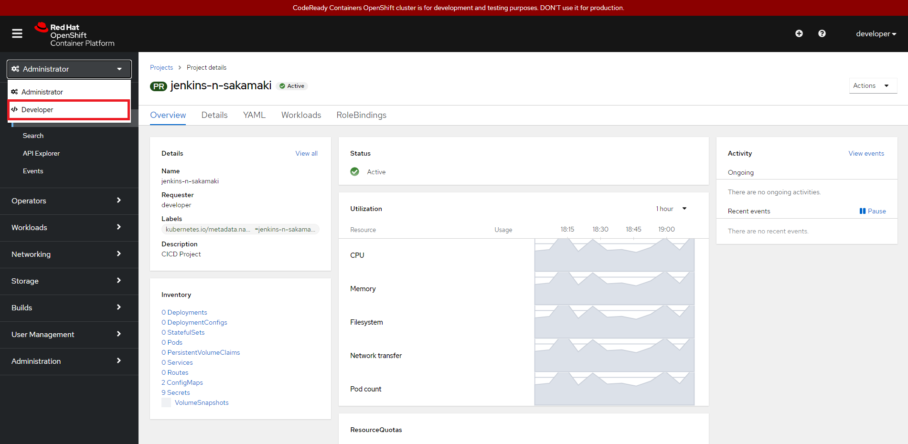
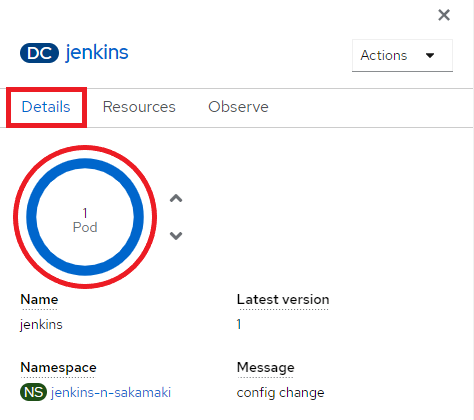
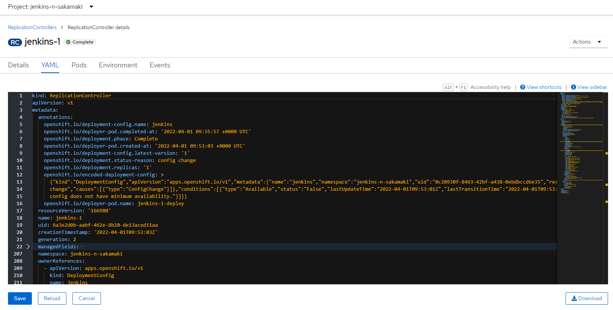
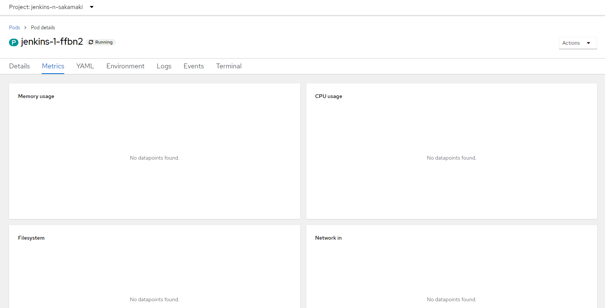

# 3. カタログ利用（Template）
ここでは OpenShift の Template 機能について学習します。予め用意されているテンプレートを利用することで、簡単にアプリケーションを利用することができます。今回は Jenkins のテンプレートを使ってみます。

**ゴール**

- Template を使って、アプリケーションがデプロイできること
- Web コンソールを操作し、DeploymentConfig や Pod の情報が閲覧できること
- CLI から Template の操作ができること

**セクション**

- 3.1. Template 使ったアプリケーションデプロイ
- 3.2. Web 画面操作
- 3.3. CLI で Template 操作

<div style="page-break-before:always"></div>

## 3.1 Template 使ったアプリケーションデプロイ
Web コンソールからテンプレートを使ってアプリケーションをデプロイします。<br>

**Step 1** 手元端末のブラウザからWeb コンソールにアクセスします。

```
URL: https://console-openshift-console.apps-crc.testing
```

SSHポートフォワードが機能していない場合は、以下コマンドで再度ポートフォワーディングを実行してください。\
※xxx.xxx.xxx.xxx はAzure VMのパブリックIPを指定する。

```
ssh user01@xxx.xxx.xxx.xxx -N -L 443:192.168.130.11:443　-L 80:192.168.130.11:80
user01@xxx.xxx.xxx.xxx's password:
```

**Step 2** Web コンソールに「developer」アカウントでログインします。
- ユーザ名：developer
- パスワード：developer


※「パスワードを変更してください」の画面が出る場合がありますが、「OK」をクリックします。


**Step 3** パースペクティブが「Administrator」になっていることを確認します。\
※パースペクティブが「Administrator」になっていない方は「Administrator」に変更してください。


**Step 4** 「Create Project」をクリックして、プロジェクトを作成します。

- Name：jenkins-<your_name>
- Display Name：CICD - Jenkins
- Description：CICD Project

※<your_name>の部分はプロジェクト名と同じ命名規則に従って個人名を設定してください。


**Step 3** パースペクティブを「Administrator」から「Developer」に変更します。



※Project が 「jenkins-<your_name>」であることを確認します


**Step 4** 「+Add」⇒「All services」からカタログ一覧ページを表示します。


**Step 5** 「Type」で「Template」を選択し、「Filter by keyword」に「jenkins」を入力し絞り込みを行います。一番左の「Jenkins」の Template を選択します。詳細ダイアログが表示されるので「Instantiate Template」をクリックします。


**Step 6** 設定はデフォルトのままで最下段の「Create」をクリックします。<br>
※ここでパラメータを設定することもできます。


**Step 7** 「Topology」ビューに自動的に移動します。丸い「jenkins」DeploymentConfig のアイコンをクリックすると、詳細情報が表示されます。


**Step 13** 「Details」タブをクリックし、レプリケーション数が 1 になるのを待ちます(1～3分程度)。



**Step 14** 「Resources」タブをクリックし、「Routes」に記載されている URL を確認します。<br>

確認したURLのホスト名の部分を手元端末のhostsファイルに追記します。

[追記例]
```
127.0.0.1 jenkins-jenkins-n-sakamaki.apps-crc.testing
```

※プライバシーエラーの画面が表示されるので、「詳細設定」⇒最下段のリンクをクリックします<br>
※502エラー画面が表示された場合は、1,2分時間を置いて何度かアクセスを試みてください。<br>


**Step 15** hostsファイル編集後、当該URLにブラウザからアクセスします。ログイン指示がでるので、「Login with Openshift」をクリックします。<br>
※OpenShift のログイン画面が表示された場合は、「developer」アカウントでログインすると次の画面に移動します。


**Step 16** 認証設定画面にアクセスするので、「Allow selected permissions」をクリックします。<br>
※次の画面に遷移するまで時間がかかりますので、そのままお待ちください(1~3分程度)


**Step 17** Jenkins の Top 画面が表示されるのを確認します。


<div style="page-break-before:always"></div>

## 3.2. Web 画面操作
Template から Jenkins がデプロイできたところで、Web UI について確認していきます。

**Step 1** 前述で実施したように、Topology ビューから、DeploymentConfig のアイコンをクリックします。<br>
上段の「( DC )」は「DeploymentConfig」を表しています。<br>
「Details」タブでは、DeploymentConfig の詳細情報が表示されています。名前やラベル、ステータス情報や作成時間が表示されます。<br>
また、円の中心には現在の Pod 数が表示され、横の矢印で Pod を増減することができます。


「Resources」タブでは DeploymentConfig に紐づく Pod や Service / Route の情報が表示されます。Route にはアクセス用の URL が表示され、クリックして別のウィンドウでアプリケーションが表示されます。


「Observe」タブでは、発生したイベントやメトリクスの情報が表示されます。また、コンテナが作成されるまでのイベント情報が表示されます。crc はデフォルトでメトリクス取得用のコンテナが起動していないため、監視用のグラフや情報は表示されません。


**Step 2** 右上の「List view」アイコンをクリックし、リストビューを表示させます。


一覧が表示されるので「jenkins」の横の「1 of 1 Pod」をクリックします。


「Details」タブでは先ほどの詳細情報の他に PV や Pod の定義情報が表示されます。


「YAML」タブでは現在の DeploymentConfig のマニフェスト情報（yaml）が表示されます。yaml ファイルのダウンロードや更新を実施することができます。



また、「Pods」には紐づく Pod の一覧、「Environment」には定義されている環境変数の一覧、「Events」にはイベントの一覧が表示されます。

**Step 3** 「Pods」タブをクリックし、起動している Pod の名前をクリックします。


「Details」、「YAML」、「Environment」、「Events」には DeploymentConfig と同じように今度は Pod の情報が表示されます。今回は表示されませんが、メトリクス情報が取得できるようになると「Metrics」に各リソースのメトリクスのグラフが表示されます。



「Logs」タブには Pod で標準出力されたログが表示されます。


「Terminal」タブでは Pod へターミナル接続できます。プロンプトが表示されているため、直接 Pod 内でコマンドが実行できます。


Web UI についての確認は以上ですが、次に移る前にGUIで作成したjenkinsプロジェクトを削除しておきます。

**Step 4** パースペクティブを「Developer」から「Administrator」に変更します。


**Step 5** 「Projects」からご自身のProject右端のアイコンを選択し、「Delete Project」を選択します。


**Step 6** 確認画面が表示されるので、ご自身のProject名を入力して「Delete」を選択してください。


## 3.3. CLI で Template 操作
今度は CLI から、Template を操作していきます。

**Step 1** ```oc login``` で ```kubeadmin``` アカウントでログインし、既存の Template を確認します。<br>
※カレントプロジェクトが自身が作成したプロジェクトになっていることを確認してください。

```
$ oc login -u kubeadmin
Logged into "https://api.crc.testing:6443" as "kubeadmin" using existing credentials.

You have access to 65 projects, the list has been suppressed. You can list all projects with 'oc projects'

Using project "n-sakamaki".

$ oc get template
No resources found in n-sakamaki namespace.
```

**Step 2** カレントプロジェクトには既存の Template は存在しません。既存の Template は ```openshift``` プロジェクトに存在するため、プロジェクトを指定して確認します。

```
$ oc get template -n openshift
NAME                                            DESCRIPTION                                                                        PARAMETERS        OBJECTS
3scale-gateway                                  3scale's APIcast is an NGINX based API gateway used to integrate your interna...   17 (8 blank)      3
amq63-basic                                     Application template for JBoss A-MQ brokers. These can be deployed as standal...   11 (4 blank)      6
amq63-persistent                                An example JBoss A-MQ application. For more information about using this temp...   13 (4 blank)      8
・・・

$ oc get template -n openshift | grep -e NAME -e jenkins
NAME                                            DESCRIPTION                                                                        PARAMETERS        OBJECTS
jenkins-ephemeral                               Jenkins service, without persistent storage....                                    8 (all set)       7
jenkins-ephemeral-monitored                     Jenkins service, without persistent storage. ...                                   9 (all set)       8
jenkins-persistent                              Jenkins service, with persistent storage....                                       10 (all set)      8
jenkins-persistent-monitored                    Jenkins service, with persistent storage. ...                                      11 (all set)      9
```

先ほど構築した Jenkins には 4 つのテンプレートがありましたが、それぞれ別の名前・種類で定義されていることがわかります。

```
Note
-n オプション：oc コマンド内で Project を指定して実行したい場合に付与します
```

**Step 3** Template からパラメータの情報を取得します。<br>
※Web 画面で構築した際にも、パラメータを入力する画面があったと思います。パラメータの情報は Template から生成されます。

```
$ oc process --parameters -n openshift jenkins-persistent
NAME                              DESCRIPTION                                                                                                                                                                                                           GENERATOR
  VALUE
JENKINS_SERVICE_NAME              The name of the OpenShift Service exposed for the Jenkins container.
  jenkins
JNLP_SERVICE_NAME                 The name of the service used for master/slave communication.
  jenkins-jnlp
ENABLE_OAUTH                      Whether to enable OAuth OpenShift integration. If false, the static account 'admin' will be initialized with the password 'password'.
  true
MEMORY_LIMIT                      Maximum amount of memory the container can use.
  1Gi
VOLUME_CAPACITY                   Volume space available for data, e.g. 512Mi, 2Gi.
  1Gi
NAMESPACE                         The OpenShift Namespace where the Jenkins ImageStream resides.
  openshift
・・・
```

```
Note
oc process：Template にパラメータを渡して マニフェストファイルの出力や Template 利用の際のコマンドです
ex) oc process my-template -o yaml | oc create -f -
※出力結果を「oc create」コマンドに渡すことでオブジェクトを作成できます。
オプション
-p：パラメータを文字列で渡します
```

**Step 4** パラメータを渡して、template から yaml を出力してみます。

```
$ oc process -n openshift jenkins-persistent -o yaml \
-p JENKINS_SERVICE_NAME=jenkins2 \
-p JNLP_SERVICE_NAME=jenkin2s-jnlp
```

**Step 5** yaml を確認できたところで、|（パイプ）を使って ```oc create``` に yaml を渡してオブジェクトを作成します。

```
$ oc process -n openshift jenkins-persistent -o yaml \
-p JENKINS_SERVICE_NAME=jenkins2 \
-p JNLP_SERVICE_NAME=jenkins2-jnlp | \
oc create -f -
↑この行までコピペして実行してください

route.route.openshift.io/jenkins2 created
configmap/jenkins2-trusted-ca-bundle created
persistentvolumeclaim/jenkins2 created
deploymentconfig.apps.openshift.io/jenkins2 created
serviceaccount/jenkins2 created
rolebinding.authorization.openshift.io/jenkins2_edit created
service/jenkins2-jnlp created
service/jenkins2 created

$ oc get all
NAME                    READY   STATUS      RESTARTS   AGE
pod/jenkins2-1-deploy   0/1     Completed   0          66s
pod/jenkins2-1-tlm67    1/1     Running     0          62s

NAME                               DESIRED   CURRENT   READY   AGE
replicationcontroller/jenkins2-1   1         1         1       66s

NAME                    TYPE        CLUSTER-IP     EXTERNAL-IP   PORT(S)     AGE
service/jenkins2        ClusterIP   10.217.5.109   <none>        80/TCP      67s
service/jenkins2-jnlp   ClusterIP   10.217.5.158   <none>        50000/TCP   67s

NAME                                          REVISION   DESIRED   CURRENT   TRIGGERED BY
deploymentconfig.apps.openshift.io/jenkins2   1          1         1         config,image(jenkins:2)

NAME                                HOST/PORT                              PATH   SERVICES   PORT    TERMINATION     WILDCARD
route.route.openshift.io/jenkins2   jenkins2-n-sakamaki.apps-crc.testing          jenkins2   <all>   edge/Redirect   None
```

CLIの操作により Template から Jenkins をデプロイできたことが確認できました。

```
Important
以下のコマンドの確認です。
利用する Template は 「openshift」Project にあるため、「oc process」コマンドでは -n オプションで「openshift」プロジェクトを指定しています。

一方で、| で yaml を渡した先の「oc create」コマンドではプロジェクトの指定がないため、カレントプロジェクトにオブジェクトを作成します。

oc process -n openshift jenkins-persistent -o yaml \
-p JENKINS_SERVICE_NAME=jenkins2 \
-p JNLP_SERVICE_NAME=jenkins2-jnlp |
oc create -f -
```

**Step 6** 最後に作成したオブジェクトを全て削除します。

```
$ oc process -n openshift jenkins-persistent -o yaml \
-p JENKINS_SERVICE_NAME=jenkins2 \
-p JNLP_SERVICE_NAME=jenkins2-jnlp | \
oc delete -f -
↑この行までコピペして実行してください
```